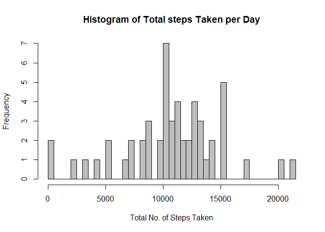
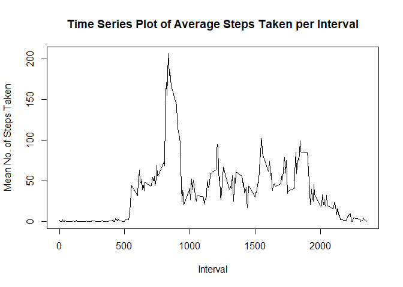
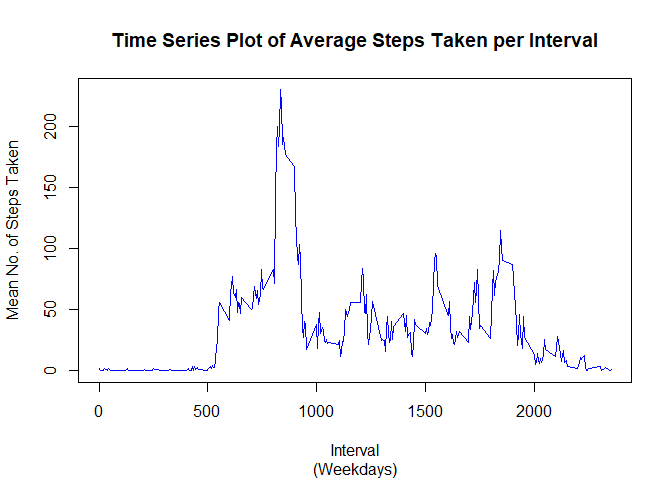

## Loading and preprocessing the data
### Loading the data
I loaded the data into the workspace using the following code:


```r
actdata <- read.csv("activity.csv", header = TRUE)
```


### Preprocessing the data
As I was more comfortable using `dplyr` for the later parts of the assignment, 
I did an additional step by converting `actdata` into a dplyr data frame table


```r
library(dplyr)
actdatadp <- tbl_df(actdata)
```


## What is mean total number of steps taken per day?
First, I had to find out the total number of steps taken per day. I group the
data set by date and then calculate the total number of steps taken per day, and
store it in the variable `stepsperday`, as per the code below:


```r
stepsperday <- actdatadp %>%
        group_by(date) %>% 
        summarise(TotalSteps = sum(steps))
```

To illustrate the distribution of the steps taken in the data set, I built a 
histogram using the total number of steps taken per day, using the
code below:


```r
hist(stepsperday[["TotalSteps"]],
     main = "Histogram of Total steps Taken per Day",
     xlab = "Total No. of Steps Taken",
     breaks = 40,
     col = "grey")
```

<!-- -->

Based on the histogram above, I had a rough guesstimate on where the mean and 
median for the daily total number of steps would be. I then calculated the total
number of steps per day:


```r
mean(stepsperday$TotalSteps, na.rm = TRUE)
```

```
## [1] 10766.19
```

```r
median(stepsperday$TotalSteps, na.rm = TRUE)
```

```
## [1] 10765
```


## What is the average daily activity pattern?
This time around, I had to group the data set by intervals and calculate the mean
number of steps per interval. I accomplished this using the code below:


```r
stepsperint <- actdatadp %>%
        group_by(interval) %>% 
        summarise(MeanSteps = mean(steps, na.rm = TRUE))
```

To illustrate the average daily activity pattern, I plotted a time series plot
with the data using the code below:


```r
plot(x = stepsperint$interval,
     y = stepsperint$MeanSteps,
     main = "Time Series Plot of Average Steps Taken per Interval",
     xlab = "Interval",
     ylab = "Mean No. of Steps Taken",
     type = "l")
```

<!-- -->

Based on the time series plot I made I could also estimate which interval had the
highest average number of steps. To find which specific interval had the highest
average number of steps, I used the following code:


```r
top <- max(stepsperint$MeanSteps)
filter(stepsperint, stepsperint$MeanSteps == top)
```

```
## # A tibble: 1 x 2
##   interval MeanSteps
##      <int>     <dbl>
## 1      835      206.
```


## Imputing missing values
There are a couple of `NAs` within the data set. To get a clear picture of how
many missing values were in the data, I had to total number of missing values first.
This can be done with the following code:


```r
sum(is.na(actdatadp$steps))
```

```
## [1] 2304
```

I then used the following code to replace the `NA` values, making use of the
mean number of steps per interval from the previous section:


```r
completeactdata <- actdatadp %>% 
  left_join(stepsperint, by = "interval") %>%
  mutate(steps = ifelse(is.na(steps), MeanSteps, steps)) %>%
  select(steps, date, interval)
```

The histogram for the total steps taken per day for new data set would thus be 
as such:


```r
stepsperdaynew <- completeactdata %>%
        group_by(date) %>% 
        summarise(TotalSteps = sum(steps))

hist(stepsperdaynew[["TotalSteps"]],
     main = "Histogram of Total steps Taken per Day",
     xlab = "Total No. of Steps Taken",
     breaks = 40,
     col = "grey")
```

<!-- -->

I also calculated the mean and median for the new data set, as follows:


```r
mean(stepsperdaynew$TotalSteps, na.rm = TRUE)
```

```
## [1] 10766.19
```

```r
median(stepsperdaynew$TotalSteps, na.rm = TRUE)
```

```
## [1] 10766.19
```

The key difference that I noticed was that the mean and the median are actually
equal in the new dataset. The addition of the respective means for each interval
decreases the variance in the data set. In other words, this means that more days
become equivalent to the mean number of steps per day or at least close to it.


## Are there differences in activity patterns between weekdays and weekends?
For this part, I would have to group the data set to two groups: *weekdays* and 
*weekends*. I had to make use of `lubridate` to convert the dates into days.
I grouped the data using the following code:


```r
library(lubridate)
completewday <- completeactdata %>%
  mutate(Day = wday(date),
         TypeofDay = ifelse(Day > 1 & Day < 7, "Weekday", "Weekend"))

weekday <- filter(completewday, TypeofDay == "Weekday")
weekend <- filter(completewday, TypeofDay == "Weekend")
```

I then grouped the data for both sets by intervals, and calculated the mean number
of steps per interval:


```r
weekdayint <- weekday %>%
  group_by(interval) %>% 
        summarise(MeanSteps = mean(steps, na.rm = TRUE))

weekendint <- weekend %>%
  group_by(interval) %>% 
        summarise(MeanSteps = mean(steps, na.rm = TRUE))
```

I then plotted a time series plot for both weekdays and weekends, as below:


```r
plot(x = weekdayint$interval,
     y = weekdayint$MeanSteps,
     main = "Time Series Plot of Average Steps Taken per Interval",
     sub = "(Weekdays)",
     xlab = "Interval",
     ylab = "Mean No. of Steps Taken",
     type = "l",
     col = "blue")
```

<!-- -->

```r
plot(x = weekendint$interval,
     y = weekendint$MeanSteps,
     main = "Time Series Plot of Average Steps Taken per Interval",
     sub = "(Weekends)",
     xlab = "Interval",
     ylab = "Mean No. of Steps Taken",
     type = "l",
     col = "red")
```

<!-- -->

Based on the time series plots, the weekends generally have a higher number of
average steps taken per interval, with the peaks being higher in the intervals
starting from `interval = 1000`. However, the average number of steps are higher
from `interval = 500` to roughly just before `interval = 1000`.

